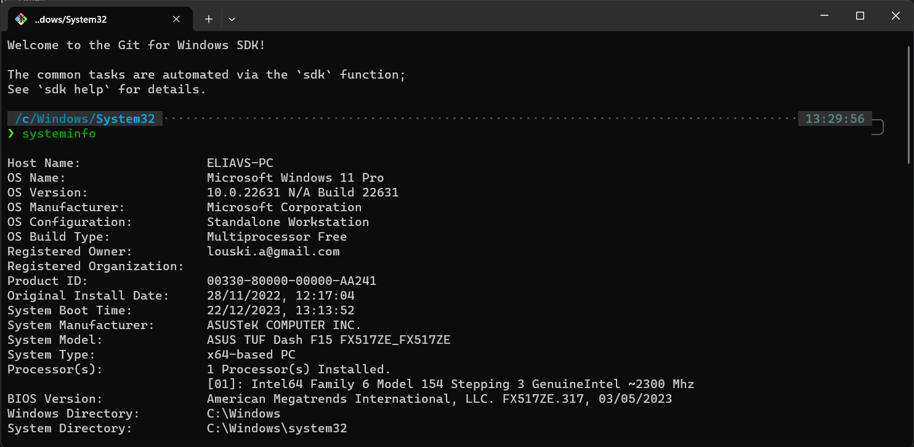

# Installing ZSH on Git Bash for windows



This guide will walk you through installing zsh with additional cool tools on windows.

You will get:
- zsh shell ([learn more](https://github.com/ohmyzsh/ohmyzsh/wiki/Installing-ZSH))
- oh-my-zsh ([learn more](https://github.com/ohmyzsh/ohmyzsh))
- powerlevel10k theme ([learn more](https://github.com/romkatv/powerlevel10k))
- zsh auto-suggestions plugin ([learn more](https://github.com/zsh-users/zsh-autosuggestions))
- zsh syntax-highlighting plugin ([learn more](https://github.com/zsh-users/zsh-syntax-highlighting))
- fzf fuzzy finder ([learn more](https://github.com/junegunn/fzf))
- adding this awesome terminal to Windows Terminal as a new profile, and optionally setting it as default.

And all that, running natively on windows, without WSL!

**Note:** this requires an additional 5GB of space on your hard drive, because we are installing Git for Windows SDK, which is a full build environment for Git for Windows.

### Why not WSL?

WSL terminal is actually running on completely different VM. executing command on windows directories from WSL terminal would be very slow because of different protocols used for communication between WSL and windows. so for example, running `npm install` from WSL terminal on windows directory would take forever.. DONT DO IT!. 
see complete explanation [npm on wsl extremely slow](https://stackoverflow.com/a/68974497/10577976).


## Steps
1. **Install Git for Windows SDK** [latest release](https://github.com/git-for-windows/build-extra/releases). (you probably want the 64bit versions so the file should be named something like `git-sdk-installer-1.0.8-64.7z.exe`) this would takes few minutes and around 5GB of space.
2. **open the newly installed git sdk bash** in `<git-sdk-dir>/git-bash.exe` (for example `C:\Software\git-sdk-64\git-bash.exe`). on first run, it is possible that few commands would run to setup the environment. wait for it to finish.
3. **Installing oh-my-zsh with p10k theme**: in git sdk bash terminal,  
    run the following commands:
    ```bash
    # install zsh
    # see https://github.com/ohmyzsh/ohmyzsh/wiki/Installing-ZSH#arch-linux-or-manjaro
    pacman -S --noconfirm zsh

    # to fix common error when running zsh on git-sdk-bash: if you get error when opening "ERROR: this script is obsolete, please see git-completion."
    # see https://stackoverflow.com/a/69396005/10577976
    echo "" > ~/.config/git/git-prompt.sh

    # install oh-my-zsh
    # see https://ohmyz.sh/#install
    sh -c "$(curl -fsSL https://raw.githubusercontent.com/ohmyzsh/ohmyzsh/master/tools/install.sh)"

    # install powerlevel10k theme
    # see https://github.com/romkatv/powerlevel10k?tab=readme-ov-file#oh-my-zsh
    git clone --depth=1 https://github.com/romkatv/powerlevel10k.git ${ZSH_CUSTOM:-$HOME/.oh-my-zsh/custom}/themes/powerlevel10k

    
    ```
    These command would install zsh, oh-my-zsh and powerlevel10k theme.
    These commands should work out of the box and this is safe to run them without any interventions, but if you get any errors, try to run the commands manually one by one.

4. **Installing zsh plugins**: run the following commands:
    ```bash
    # install zsh auto-suggestions plugin
    # see https://github.com/zsh-users/zsh-autosuggestions/blob/master/INSTALL.md#oh-my-zsh
    git clone https://github.com/zsh-users/zsh-autosuggestions ${ZSH_CUSTOM:-~/.oh-my-zsh/custom}/plugins/zsh-autosuggestions

    # install zsh syntax-highlighting plugin
    # see https://github.com/zsh-users/zsh-syntax-highlighting/blob/master/INSTALL.md#in-your-zshrc
    # note: this command is adjusted to clone to ~/.oh-my-zsh/custom/plugins/zsh-syntax-highlighting instead of local dir like the docs suggest
    # this would add the plugin zsh-syntax-highlighting to oh-my-zsh plugins dir
    git clone https://github.com/zsh-users/zsh-syntax-highlighting.git ${ZSH_CUSTOM:-~/.oh-my-zsh/custom}/plugins/zsh-syntax-highlighting
    # this would activate the plugin when zsh starts
    echo "source ${ZSH_CUSTOM:-~/.oh-my-zsh/custom}/plugins/zsh-syntax-highlighting/zsh-syntax-highlighting/zsh-syntax-highlighting.zsh" >> ${ZDOTDIR:-$HOME}/.zshrc
5. **Installing fzf**: run the following commands:
    ```bash
    # install fzf
    # see https://github.com/junegunn/fzf?tab=readme-ov-file#using-git
    git clone --depth 1 https://github.com/junegunn/fzf.git ~/.fzf
    ~/.fzf/install
    ```
6. **Configuring windows terminal**
    download these fonts and follow the instructions: https://github.com/romkatv/powerlevel10k?tab=readme-ov-file#manual-font-installation
    add a new windows terminal profile with the following command line: `C:\Software\git-sdk-64\msys2_shell.cmd -defterm -here -no-start -mingw64 -shell zsh`
7. open windows terminal. you will zsh with p10k theme opening. it might ask you interactively to configure the theme. follow the instructions.

That's it! you now have a fully functional awesome zsh terminal on windows!